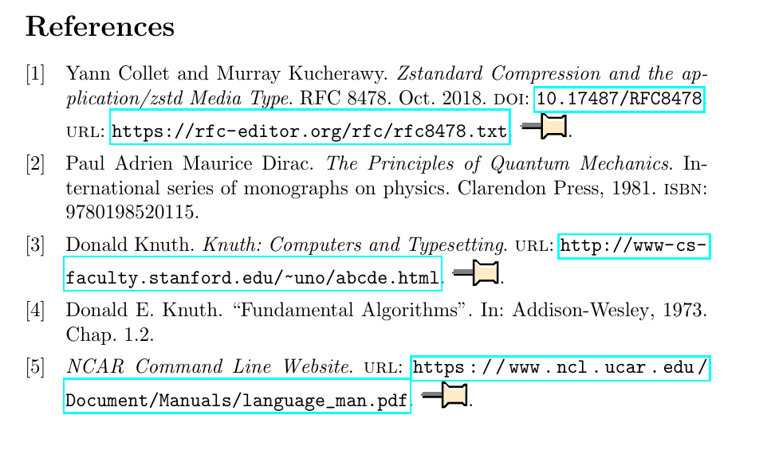

# bibemb

This project aims to embed a offline version of each bibliography entry inside the latex itself.



## Features
 - Automatic download of the references
 - Embed when url tag is available in the .bib
 - Detects url source modification

 ## How it works
 Bibemb is executed each time the LaTeX project is compiled. It parse each bibliography entry and downloads a offline version if necesary. In the case of PDFs, they are embeded directly on each reference. For any other url, a html webpage is embedded.

 ## Requirements

 - Python 3
 - pybtex (pip)
 - [monolith](https://github.com/Y2Z/monolith)
 - LaTeX :)
 - biblatex
 - attachfile2

 ## Usage

1. Download the python script in the root of your LaTeX project

`wget https://raw.githubusercontent.com/vk496/bibemb/master/bibemb.py`

2. Add this block to your LaTeX preamble (assuming your bib file is `biblio.bib`):
```
\usepackage{attachfile2}

\addbibresource{biblio.bib}

% To execute this command, must pass "-shell-escape" to the latex build command
\immediate\write18{python bibemb.py biblio.bib}

\DeclareSourcemap{
  \maps[datatype=bibtex]{
    \map{
      \step[
          fieldset=addendum,
          fieldvalue=\IfFileExists{bib_external_resources/\unexpanded{\thefield{entrykey}}.pdf}
                        {\attachfile{bib_external_resources/\unexpanded{\thefield{entrykey}}.pdf}}
                        {\IfFileExists{bib_external_resources/\unexpanded{\thefield{entrykey}}.html}
                            {\attachfile{bib_external_resources/\unexpanded{\thefield{entrykey}}.html}}
                            {}
                        }
      ]
    }
  }
}
```

Make sure you to pass the `-shell-escape` flag to your LaTeX build or bibemb will not be executed during the build of your document.

Check a example [HERE](https://raw.githubusercontent.com/vk496/bibemb/master/report.pdf)